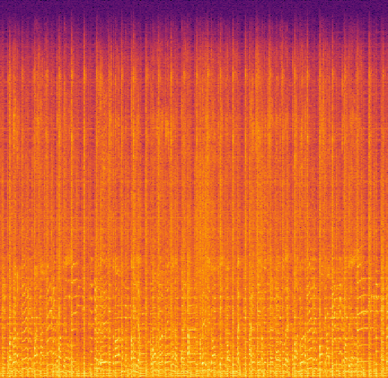
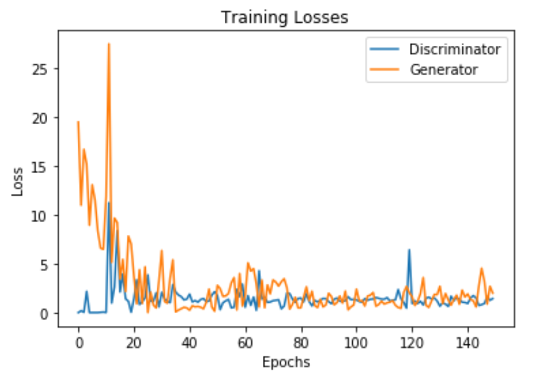

# Generate Music Using Generative Adversarial Network (GAN)
This repo includes all the code for generating new Music from existing Music.
This model was trained on 100 such images from a particular genre of music.

# Training Results
### Version 2 Sample Results

### Version 3 Sample Results

